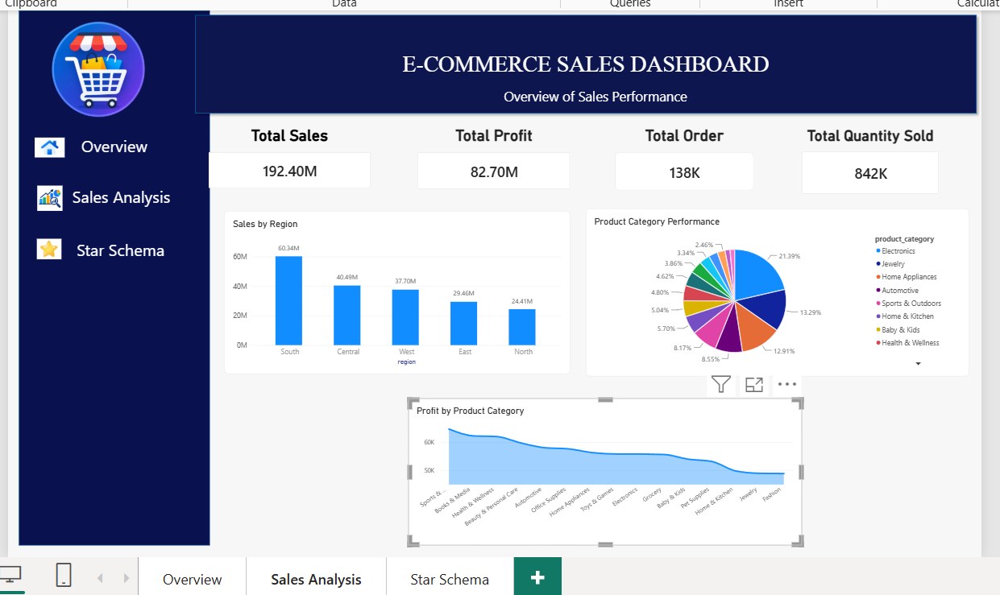
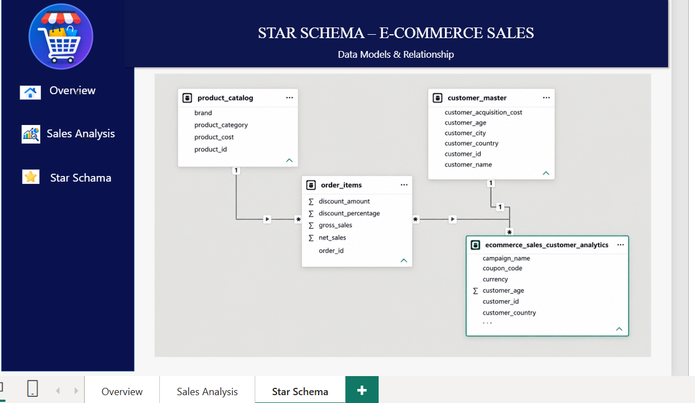

# E-COMMERCE-SALES-DASHBOARD
# E-Commerce Sales Dashboard

## 📊 Project Overview

The **E-Commerce Sales Dashboard** is an interactive Power BI project developed to analyze and visualize e-commerce sales performance.

The dashboard provides insights into sales, profit, orders, quantity sold, regional performance, and product category performance. A star-schema-based data model is also included to organize and analyze the data efficiently.

## 🎯 Objectives

- Analyze overall e-commerce sales performance.
- Track total sales, profit, orders, and quantity sold.
- Compare sales performance across different regions.
- Analyze product category performance.
- Analyze profit by product category.
- Build a structured star schema for data analysis.
- Present business insights through interactive Power BI visualizations.

## 🛠️ Tools & Technologies

- **Power BI**
- **Power Query**
- **DAX**
- **Star Schema Data Modeling**
- **Data Visualization**

## 📌 Dashboard KPIs

| KPI | Value |
|---|---:|
| Total Sales | 192.40M |
| Total Profit | 82.70M |
| Total Orders | 138K |
| Total Quantity Sold | 842K |

## 📈 Dashboard Features

### 1. Sales Overview
The dashboard provides an overview of key sales performance indicators including total sales, total profit, total orders, and total quantity sold.

### 2. Sales Analysis
The Sales Analysis page contains visualizations for:

- Sales by Region
- Product Category Performance
- Profit by Product Category

### 3. Star Schema

The project includes a structured data model containing tables related to:

- Products
- Customers
- Orders / Order Items
- E-commerce sales data

The star-schema approach helps organize relationships between transactional and master data for efficient analysis.

## 📊 Dashboard Preview

### Sales Analysis

### Star Schema

## 📁 Project Files

- `star schema.pbix` – Power BI dashboard and data model
- `README.md` – Project documentation
- `.gitattributes` – Git LFS configuration

## 🚀 How to Use

1. Download or clone this repository.
2. Open `star schema.pbix` using Microsoft Power BI Desktop.
3. Explore the Overview, Sales Analysis, and Star Schema pages.
4. Interact with the available Power BI visuals and filters.

## 👩‍💻 Author

**Jagruti Musale**

MCA Student  
Interested in Data Analytics, Machine Learning, Python, and Business Intelligence.
